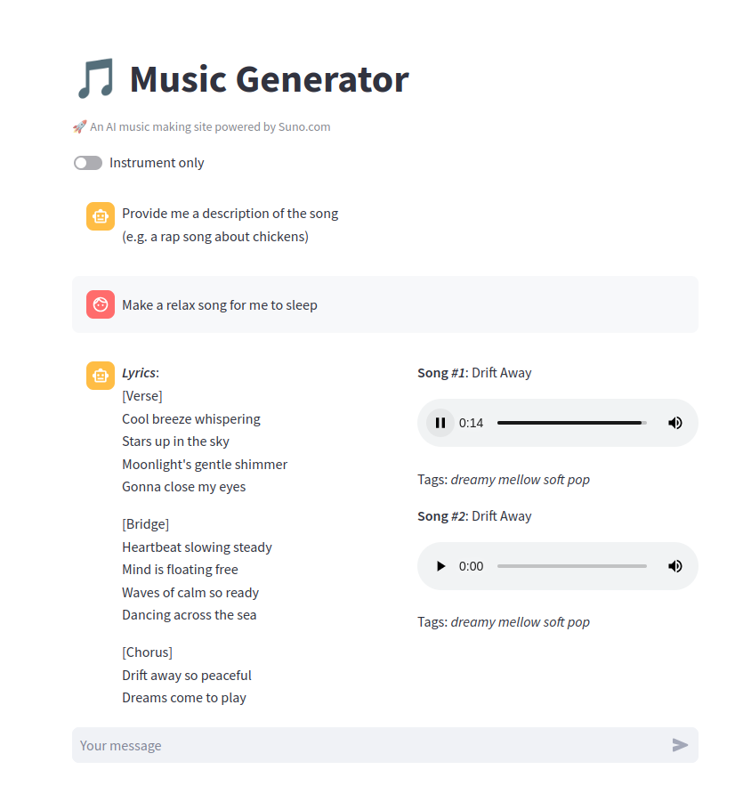
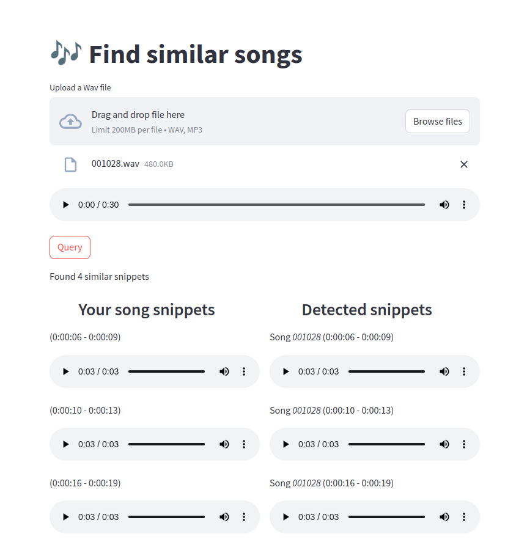

# AI Music Generation Project

## Introduction
This is a repository for my personal project, which is a simple web application that lets you **generate music 🎵 through a chat interface 💬**. As the music generative AI models are widely trained on human music, the generated music is very likely to have some similarity to the existing songs. Dealing with this ethical problem, this project also provides a **music similarity search feature 🔍** to detect if the song has any similar music snippets.

## Overview

As mentioned above, this app provides 2 main features:
- Music generation with Chat interface
- Music similarity search

The user interface of the app is powered by [Streamlit](https://streamlit.io/) and the backend API was implemented using [FastAPI](https://fastapi.tiangolo.com/).

First, the music generation feature is mostly done by calling [Suno API](https://suno.com/). As the site has not published the API, the API call must be provided with `Cookie` and `Session ID` of a logged-in suno account.

Second, the music similarity search feature is based on the **Audio Fingerprint** research topic which utilizes a *Music Embedding Model* and a *Vector Database* to store and query the extracted embeddings. To deploy this feature, this project used [NVIDIA Triton Inference Server](https://developer.nvidia.com/triton-inference-server) to deploy the model and [Milvus Vector Database](https://milvus.io/) for the retrieval task.

The music embedding model is trained using [Pytorch](https://pytorch.org/) and based on Audio Fingerprint research field. For further training details, please visit the directory `./train/README.md`.

## Table of Contents
- [Installation](#installation)
- [Usage](#usage)
- [Demo](#demo)
- [Contributing](#contributing)
- [Credits](#credits)

## Installation
To set up the project, please follow these steps:

### Clone & Dependencies

```bash
# Clone the repository
git clone https://github.com/Huy1711/AI-beat-maker.git

# Install the required dependencies
pip install -r requirements-dev.txt
```
Note: This project is built and tested on `python 3.10`.

### Download Music Embedding Model

Visit this [Google Drive](https://drive.google.com/file/d/1DPwgDD0xxQsIY4ru2QaH1wpngxG3VvJY/view?usp=sharing) or use the command below to download the model on Kaggle:

```bash
# Download model on Kaggle
kaggle models instances versions download huy1711/model.pt/pyTorch/v1/1

# Untar the model file and move to Triton model_repository folder
tar -xvf model.pt.tar.gz
mv model.pt ./deploy/music_embedding/model_repository/neuralfp/1/
```

### Prepare Demo Dataset for Music Search

For a quick demo, I tried to use the pre-processed `fma_medium` dataset available at [Kaggle datasets](https://www.kaggle.com/datasets/mimbres/neural-audio-fingerprint). If you want to use the CLI, follow the [Kaggle API installation and authentication](https://www.kaggle.com/docs/api) instruction, and use the commands below to download the dataset:

(Note: You can skip this step if you already downloaded the dataset by following the preparation instruction in `./train` folder)
```bash
kaggle datasets download -d mimbres/neural-audio-fingerprint

mkdir ./datasets
unzip neural-audio-fingerprint.zip -d ./datasets/
```

After unzipping, the dataset should be available at `./datasets/neural-audio-fp-dataset` folder, then run the dataset preparation script

```bash
python ./scripts/make_id2path_dict.py
```

## Usage
This project supports deployment using `docker-compose`.
For the installation instruction, please visit https://docs.docker.com/compose/install/

If you want to change the Milvus database volume directory (default is `./volumes`), change the path in the `.env.example` file and **rename the file to `.env`**.

To start the application, run the following command:

```bash
docker-compose up -d
```

To add `fma_medium` demo dataset to Milvus Vector DB, use the following command
```
bash ./scripts/prepare_milvus.sh
```

The application will be available at `http://localhost:8081`.

To get the suno `session_id` and `cookie`, follow these steps:

## Demo

Music Generation Chat interface  |  Music Search interface
:-------------------------:|:-------------------------:
 | 

Video demo: [Google Drive link](https://drive.google.com/file/d/1JjCVqMwW-2azgwTtjPgFX2xQ0ZO1Ce3t/view?usp=sharing)

Note: Due to the limitation in the number of song in the Vector Database, the positive music search cases are rare. If you want to test the positive cases, please use the song inside `./datasets/neural-audio-fp-dataset/music/test-query-db-500-30s/query` folder which include the perturbed version of the songs in the database. Otherwise, you will need to add more songs to the database (see ``./scripts/milvusdb_manage/add_embedding_offline.py``).

## Contributing
If you find any issues or have suggestions for improvements, please feel free to open an issue or send me an email via nguyenduchuy1711@gmail.com.

## Credits
This project was developed by @Huy1711 and uses the [Suno API](https://suno.com/) to generate and fetch music data.
