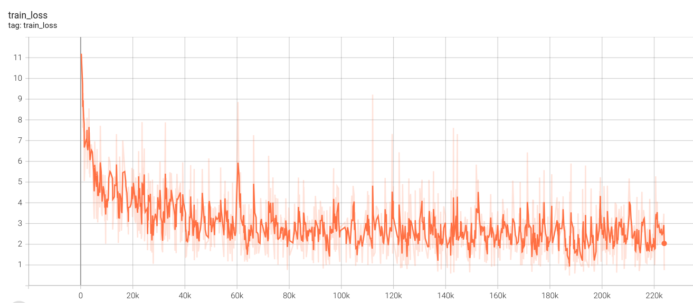
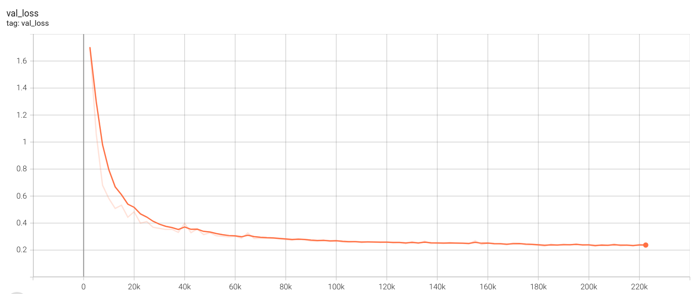

## Neural Audio Fingerprint implementation

This folder contains the code for reproducing [Neural Audio Fingerprint (NeuralFP)](https://arxiv.org/abs/2010.11910) paper. The NeuralFP model is utilized as music embedding extraction model for the music search feature of this project.

This implementation is mostly inspired by [Original TensorFlow implementation](https://github.com/mimbres/neural-audio-fp) and [PyTorch implementation by Yi-Feng Chen](https://github.com/stdio2016/pfann).

[Pytorch lightning](https://lightning.ai/) library is used for fast model experimenting and configuration. The training script is `train_neuralfp.py` and the main training module is in `neuralfp/module/audio_fingerprint.py`. The model is then exported to ` torchscript` format for the deployment using Triton Server.

## How to reproduce

Please visit this [Google Colab Notebook](https://colab.research.google.com/drive/1rVrzvJ7j-i2oMLl7F6zVcIZ_m79SEePA?usp=sharing) or [Kaggle Kernel](https://www.kaggle.com/huy1711/neural-audiofp-train) for quick reproduction of this experiment. Those notebooks include runnable installation, dataset preparation, and training script.

Default training config is for GPU-enabled, if you do not want to use GPU, please change the configuration in `./configs/train.yaml`.

For local machine run, please follow the steps below.

### Clone & Dependencies

```bash
# Clone the repository
git clone https://github.com/Huy1711/AI-beat-maker.git

# Move to the train directory and install the dependencies
cd ./train
conda install pytorch torchaudio pytorch-cuda=11.8 -c pytorch -c nvidia
pip install -r requirements.txt
```
Note: To install `pytorch`, you can use either `conda` or `pip`, please visit `https://pytorch.org/` for further details.

### Download Dataset

In this experiment, the `fma_medium` dataset is used similar with the original paper, there is a pre-processed version uploaded to Kaggle by the authors.

Visit [kaggle dataset](https://www.kaggle.com/datasets/mimbres/neural-audio-fingerprint) or use the Kaggle CLI command below to download the dataset:

```bash
kaggle datasets download -d mimbres/neural-audio-fingerprint

# Move to the ./datasets folder
mkdir ./datasets
unzip neural-audio-fingerprint.zip -d ./datasets/
```

### Start training

Before training, take a look at `train/configs/train.yaml` configuration file and update the options to ensure compatibility with your local machine.

```bash
python train_neuralfp.py
```

## Results

Here is the tensorboard of this reproduced experiment:




The evaluation is done later, after the implementation of server deployment (using Triton Server and Milvus Vector Database).
